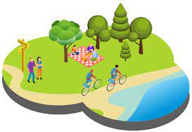

# 旅遊減碳
## 1. 旅遊業碳足跡現狀分析
介紹目前全球旅遊業的碳排放`數據`和`現狀`。
## 2. 旅遊減碳的全球挑戰與機會
**分析全球旅遊業在減碳過程中的挑戰與潛在機會。**
- *高碳排放*的交通方式

- 旅遊<sub>基礎設施</sub>的碳密集度

- <ins>消費者行為</ins>的改變困難

- **全球**政策與規範的不一致

- <sup>經濟壓力</sup>與成本問題

## 3. 綠色旅遊：如何減少碳排放？
探討綠色旅遊的概念及其如何幫助減少碳足跡。
```
CO2​ 排放量=能源消耗量×能源碳排放因子
CO2​ 排放量=食物重量×食物碳足跡
總碳排放量=∑(各活動的碳排放量)
```
## 4. 旅遊業的創新減碳策略
介紹目前各國和企業採用的創新策略\
減少旅遊過程中的碳排放

## 5. 推動可持續發展的未來策略
討論未來旅遊業如何推動可持續發展，並實現全面的減碳目標。
